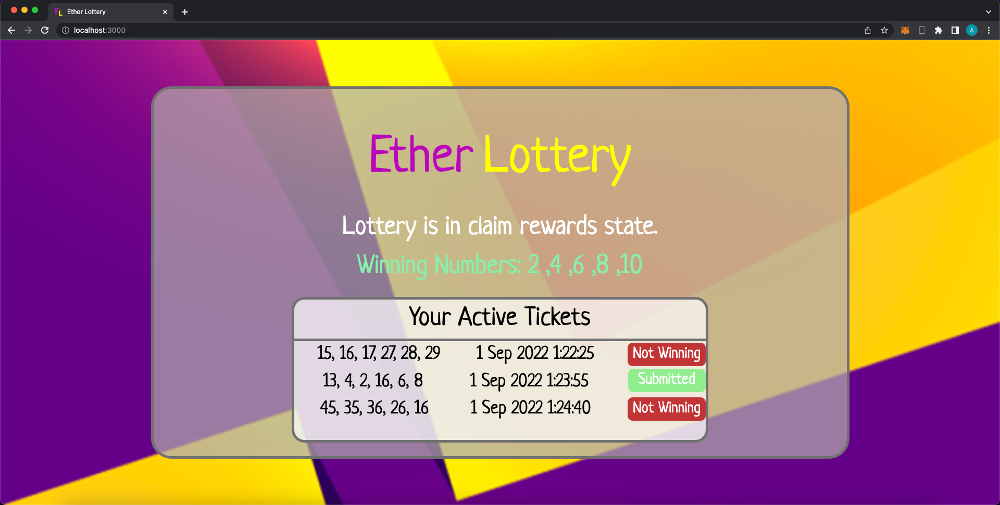

# Ethereum Lottery Game - In progress

An ethereum based lottery that uses Chainlink's VRF to prove the randomness of the game. Currently in construction.

# Setup
```bash
npm install ethers react-bootstrap react-spinners-kit react-router-dom react-checkmark --legacy-peer-deps
```

# Screenshots




# Videos

1) Buying Tickets.
https://youtu.be/SVaOjVFpilg

2) Submitting Tickets.
https://youtu.be/8FmOfF16Z0U